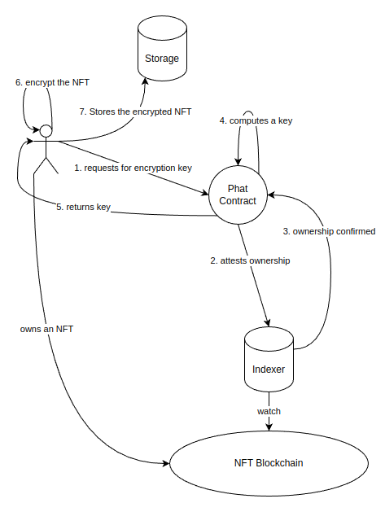

# Implementing NFT Ownership Management with Phat Contracts

This demo shows how to use Phala's Phat Contracts to manage NFT ownership. 

## Use Case

An NFT is a digital asset that is exclusively owned by a person or an entity. Like any assets, NFTs can be put into the market, but unlike other assets, the original data of an NFT must not be revealed until the ownership transfer is considered done by some supervisors. To ensure the confidentiality of the NFT, the owner must encrypt it with a key, and in common sense he must save the key somewhere, losing the key is equivalent to losing the asset. This is just one of the problems.

Another problem is, how can we be sure that the new owner of an NFT is actually able to decrypt it? We need a third party to supervise the transaction. This third party must be trustworthy, and is not owned by any side of the transaction, and its operation is transparent to all participants -- in the blockchain land, this third party is a smart contract, you either trust it by its fame, or by its open source. But the problem still remains. Although we are sure a deal is done on the chain, but off the chain, there are chances where the formal owner wouldn't hand over the encryption key, the buyer has pain for the NFT but what he gets is an unbreakable ciphertext.

Then here comes another fourth party. This fourth party will take care of all keys, the advantage it brings is multifold: 

1. each NFT has an unique key, which ensures no other keys can decrypt the encrypted NFT
2. only the owner has access to the key, attestations will be performed to confirm the ownership
3. if the former owner refuses to hand over the key, the buyer still gets the key from the fourth party
4. the fourth party never stores keys, which lowers the chance of secret leaks

In blockchain land, this fourth party is also a smart contract.

## Rationale of Phat Contracts

It's possible for the third party that supervises NFT transactions to also play the role of the said fourth party. However, traditional smart contracts have many limitations. They are on-chain programs that are supposed to maintain blockchain state consistency by cutting themselves off the functionalities that can bring in uncertainties, for example, data storage can fail on disk corruption, network connections break due to power outage. Hence, it may be hard or impossible to build the fourth party. Besides, the gas fees paid for the contract services are usually high.

Phat Contracts are designed to solved these problems. In Phat Contract system, creating an application is as easy as in Web2. This demo demostrates the use of crypto and HTTP libraries, and apart from that, the possiblity of implementing complex business logic.

## Workflow



Someone owns an NFT from an NFT blockchain. The following events happen in this order:

1. the client desktop/app he uses sends a request to the Phat contract for an encryption key to encrypt that specific NFT
2. the Phat Contract queries the indexer so as to attest the caller's ownership
3. the indexer confirms the ownership to be true
4. the Phat Contract computes the encryption key based on the metadata of the NFT
5. the Phat Contract returns the key to the client end
6. the client encrypts the NFT
7. the client stores the encrypted NFT somewhere

If the owner has sold the NFT, then he will have no access to the encryption key again, it's up to the Phat Contract developer to decide what key managing stategies to use, but we can see that the access control mechanism is achieved by off-chain operations, this is almost impossible for smart contracts other than Phat Contracts.

## Build

```shell
git submodule update --init
cargo test --features mockable -- --nocapture
```